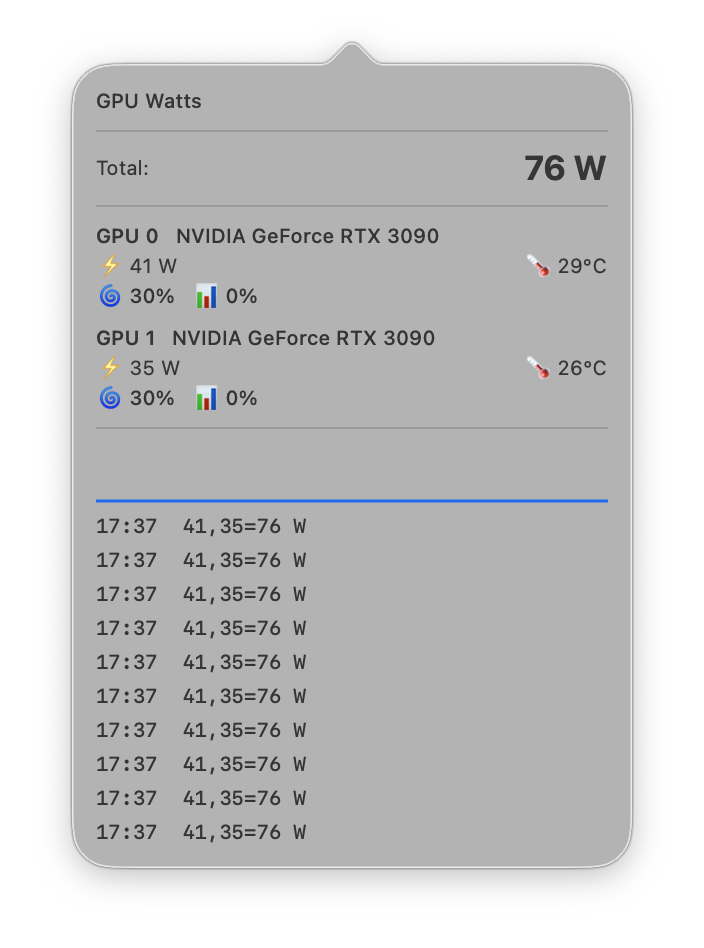

# NVIDIA SMI macOS Monitor

Real-time GPU power monitoring for NVIDIA GPUs on a remote Linux machine, displayed as a native macOS menu bar application.

The server queries `nvidia-smi` on a Linux machine with NVIDIA GPUs and exposes metrics over HTTPS. The macOS client polls the server and displays total GPU power draw in the menu bar, with a detailed popover showing per-GPU breakdowns and a sparkline trend chart.

## Architecture

```
[Linux GPU Server]                          [macOS Client]
+---------------------+                     +------------------------+
| gpu_power_server.py |  HTTPS (port 9090)  | GPUWatts (SwiftUI)     |
|                     |  <----------------  | Menu Bar Status Item   |
| - GET /v1/metrics   |  JSON response      | - Polls every 3s       |
| - GET /healthz      |                     | - Shows total watts    |
| - GET / (legacy)    |                     | - Popover with details |
+---------------------+                     +------------------------+
         |                                       |
   nvidia-smi CLI                         TrustIgnoringDelegate
   (subprocess calls)                     (accepts self-signed cert)
```

## Prerequisites

### Server
- **Python 3** (stdlib only — no pip dependencies)
- **`nvidia-smi`** CLI (shipped with NVIDIA GPU drivers)
- **`openssl`** CLI (for auto-generating self-signed certificates)
- Linux machine with one or more NVIDIA GPUs

### Client
- **Swift 5.9+** toolchain
- **macOS 13+** (Ventura)
- **Xcode Command Line Tools** (for `swift build`)
- Network reachability to the server

## Setup & Deployment

### 1. Server

**Manual run:**

```bash
# Basic usage (auto-generates self-signed cert, listens on 0.0.0.0:9090)
python3 gpu-server/gpu_power_server.py

# Custom host and port
python3 gpu-server/gpu_power_server.py --host 127.0.0.1 --port 8080

# With your own TLS certificates
python3 gpu-server/gpu_power_server.py --cert /path/to/cert.pem --key /path/to/key.pem
```

On first run, the server automatically generates a self-signed TLS certificate (RSA 2048, valid 10 years) stored in `gpu-server/.certs/`.

**Systemd daemon:**

```bash
# Copy the unit file and edit paths to match your environment
sudo cp gpu-server/gpu-power-server.service /etc/systemd/system/
sudo nano /etc/systemd/system/gpu-power-server.service   # adjust User, WorkingDirectory, ExecStart
sudo systemctl daemon-reload
sudo systemctl enable --now gpu-power-server
```

### 2. Client

**Configure the server URL:**

Open `gpu-watts/GPUWatts/AppDelegate.swift` and change the hardcoded server host:

```swift
static let serverHost = "your-server-address"
```

**Build and run:**

```bash
cd gpu-watts
swift build -c release
.build/arm64-apple-macosx/release/GPUWatts
```

Or run directly in development mode:

```bash
cd gpu-watts && swift run
```

## API Reference

| Endpoint | Description |
|----------|-------------|
| `GET /v1/metrics` | Full per-GPU metrics (id, name, power, temp, fan, utilization) plus `total_watts` and `timestamp` |
| `GET /` or `GET /watts` | Compact format with `total_watts`, `count`, `per_gpu` array (legacy) |
| `GET /healthz` | Health check — returns `{"status": "ok"}` |

## Usage

- The app shows the **total GPU power draw** (e.g. `320 W`) in the macOS menu bar.
- **Left-click** to open a popover with per-GPU details and a sparkline trend chart.
- **Right-click** (or Control-click) to quit the application.

## Project Structure

```
├── gpu-server/
│   ├── gpu_power_server.py          # Python HTTP server + nvidia-smi integration
│   └── gpu-power-server.service     # systemd unit file
└── gpu-watts/
    ├── Package.swift                # Swift package manifest
    └── GPUWatts/
        ├── App.swift                # SwiftUI entry point
        ├── AppDelegate.swift        # Status bar, polling, network fetch
        ├── MetricModels.swift       # Codable data models
        ├── PopoverContent.swift     # Popover detail view
        ├── SparklineView.swift      # Sparkline trend chart
        └── TrustIgnoringDelegate.swift  # Self-signed cert handling
```

## Security

The macOS client uses a `TrustIgnoringDelegate` that **blindly trusts any TLS certificate**, including self-signed ones. This is convenient for local development but means:

- The connection is **vulnerable to MITM attacks** on untrusted networks.
- The server's identity is **not verified** — any endpoint presenting a valid TLS handshake will be accepted.

**This is intended for local/trusted networks only.** Do not route traffic through untrusted networks (e.g., the public internet) without replacing the delegate with proper certificate pinning or a trusted CA-issued certificate.

## Changelog

- **2026-05-09** — Initial release

## Example
Shows the usage for what GPUs you have along with the last 5 results from the API.


## License

MIT — see [LICENSE](LICENSE) for details.
